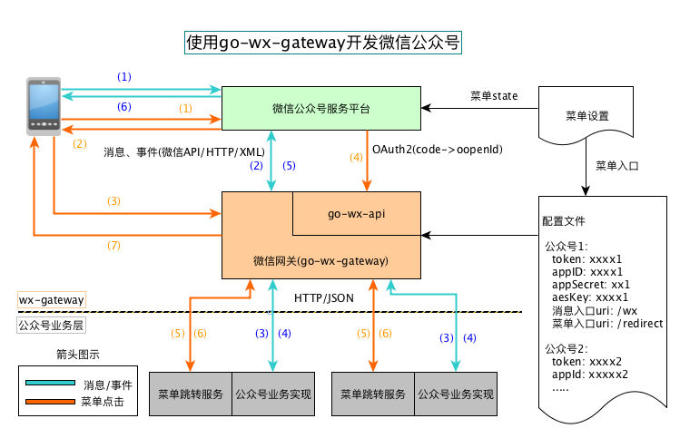

# 通用微信公众号网关服务

 1. `go-wx-gateway`是基于[go-wx-api](https://github.com/rosbit/go-wx-api)的实现的**微信公众号网关**服务。
 1. 类比nginx是HTTP的反向代理程序，`go-wx-gateway`是**微信公众号平台API接口**的反向代理程序
 1. `go-wx-gateway`不是简单地把微信公众号API相关的数据进行传递，而是把它发送和接收的包做了拆包、打包的封装，
     使得`go-wx-gateway`反向代理后面的业务实现大大的简化了
 1. `go-wx-gateway`运行后，通过http与后端业务服务通讯，任何支持http服务的语言都可以实现业务代码。

## 架构图

 

 1. 有了`go-wx-gateway`，微信公众号服务的开发就是普通的web服务开发
 1. 微信公众号服务主要处理两类数据流：
     - 消息/事件处理: 包括文本输入、图片上传、二维码扫描等等
     - 菜单点击：`go-wx-gateway`希望接管所有的菜单点击事件，然后把用户信息、菜单state值转发给菜单处理服务
 1. `go-wx-gateway`和业务代码间使用HTTP传输数据，数据的格式为JSON。

## 下载、编译方法
 1. 前提：已经安装go 1.11.x及以上、git、make
 2. 进入任一文件夹，执行命令

    ```bash
    $ git clone https://github.com/rosbit/go-wx-gateway
    $ cd go-wx-gateway
    $ make
    ```
 3. 编译成功，会得到`wx-gateway`的可执行程序。可以执行`./wx-gateway -v`显示程序信息。

## 运行方法
 1. 环境变量
    - CONF_FILE: 指明配置的路径，格式见下文
 1. 配置文件格式
    - 是一个JSON
    - 例子，可以通过`sample.conf.json`进行修改:

      ```json
      {
		  "listen-host": "",
		  "listen-port": 7080,
		  "services": [
			 {
				 "name": "一个名字，随便取",
				 "workerNum": 5,
				 "timeout": 0,
				 "wx-params": {
					 "token": "开发/服务器配置中的Token",
					 "app-id": "开发/公众号开发信息中的AppId",
					 "app-secret": "开发/公众号开发信息中的AppSecret",
					 "aes-key": "开发/服务器配置中的EncodingAESKey。如果是明文传输，则该串为空或null"
				 },
				 "listen-endpoints": {
					 "service-path": "/wx  --开发/服务器配置/服务器地址中的路径部分",
					 "redirect-path": "/redirect --这个是微信网页授权用到的，设置菜单时都用这个路径"
				 },
				 "msg-proxy-pass": "http://yourhost.or.ip.here    --这个地址指向消息/事件处理的服务，如果不处理可以为空",
				 "menu-handler": "http://yourhost.or.ip/handler/path --这个地址指向菜单处理的服务，如果不处理可以为空"
			 },
             {
                 "name": "如果有其它的公众号服务，可以参考上面的信息配置",
                 "注意": "listen-endpoints中的路径 不能 相同"
             }
		  ]
      }
      ```
 1. 运行wx-gateway
    - `$ CONF_FILE=./wx-gateway-conf.json ./wx-gateway`

## 与业务代码间的通讯
 1. 如果没有配置`msg-proxy-pass`、`menu-handler`，则`wx-gateway`可以作为工具**启用**`开发/服务器配置`，并可以对关注公众号
    的用户通过文本框实现回声应答，是公众号开发必备的调试工具。
 2. 与`msg-proxy-pass`的通讯
     - `msg-porxy-pass`配置的是一个URL地址前缀，`wx-gateway`会把消息、事件类型加到后面合成完整的URL。比如:
         - `msg-proxy-pass`配置的是`http://wx.myhost.com/msghandler`
         - 当`wx-gateway`收到用户的文本消息时，则会把消息转发给`http://wx.myhost.com/msghandler/msg/text`
         - 当`wx-gateway`收到新用户关注事件时，则会把消息转发给`http://wx.myhost.com/msghandler/event/subscribe`
     - 上例中，`msg`、`event`是转发类型、`text`、`subscribe`是具体的消息或事件名称，所有名称都对应微信公众平台对应的消息
     - 所有HTTP请求都是`POST`，所有的请求/响应结果都是`JSON`，请求体的JSON是对微信公众号API消息的XML格式做了转换，具体字段仍然可以参考微信公众号API
     - `msg`消息名称有**text**、**image**、**voice**、**video**、**shortvideo**、**location**、**link**
     - `event`事件名称有**CLICK**、**VIEW**、**subscribe**、**unsubscribe**、**location**、**LOCATION**、**pic_sysphoto**、**pic_photo_or_album**、**pic_weixin**、**scancode_waitmsg**、**scancode_push**、**MASSSENDJOBFINISH**、**TEMPLATESENDJOBFINISH**
     - `msg`消息请求/响应举例，名称`text`
         - url: &lt;msg-proxy-pass&gt;/msg/text
         - 请求消息体: 

                 ```json
                 {
                    "ToUserName": "公众号的id",
                    "FromUserName": "发送消息的用户的openId",
                    "CreateTime": 1556088649,
                    "MsgType": "text",
                    "Content": "用户发送的文本内容",
                    "MsgId": "22277834746191186"
                 }
                 ```

         - 响应
              - 如果成功，一定是回复200消息，消息体格式

                 ```json
                 {
                    "type": "text",
                    "msg": "需要返回给用户的消息内容"
                 }
                 ```
              - "type"可以是"voice"、"video"、"image"等，"msg"则是它们对应的"mediaId"
     - `event`消息请求/响应举例，名称`subscribe`
         - 请求消息体: 

                 ```json
                 {
                    "ToUserName": "公众号的id",
                    "FromUserName": "关注公众号的用户的openId",
                    "CreateTime": 1556088649,
                    "MsgType": "event",
                    "Event": "subscribe",
                    "EventKey": "",
                 }
                 ```

         - 响应
              - 与消息是一样的
              - 如果成功，一定是回复200消息，消息体格式

                 ```json
                 {
                    "type": "text",
                    "msg": "需要返回给用户的消息内容"
                 }
                 ```
              - "type"可以是"voice"、"video"、"image"等，"msg"则是它们对应的"mediaId"
 2. 与`menu-handler`的通讯
     - `menu-handler`配置的是一个URL，比如
         - `menu-handler`配置的是`http://wx.myhost.com/menu/redirect`
         - 当`wx-gateway`接收到菜单请求时，则会把消息转发给上面的URL
         - HTTP请求的方法都是`POST`，请求/响应结果都是`JSON`
     - 为了让`wx-gateway`收到菜单点击事件，要按下面的格式设置菜单触发的URL:
         - `https://open.weixin.qq.com/connect/oauth2/authorize?appid=在这里填公众号的AppId&redirect_uri=http%3A//wx.myhost.com/这是redirect-path配置的值&response_type=code&scope=snsapi_base&state=这个值用于区分菜单项#wechat_redirect`
         - 只有配置正确`wx-gateway`才能收到菜单事件，并通过code获取到点击菜单的用户的openId，并转发给`menu-handler`
     - 请求`menu-handler`的请求消息格式

         ```json
         {
              "appId": "公众号的AppId，如果同时处理多个公众号，可以用来区分来源",
              "openId": "点击菜单的用户的openId",
              "state": "在菜单配置中的state的值，用于区分菜单项"
         }
         ```

     - 响应结果消息格式

        ```json
        {
              "h": {
                   "如果不为空": "是需要给微信浏览器设置的header信息",
                   "Set-Cookie": "可以是cookie格式的header信息"
              }
              "r": "如果不为空，这里制定需要wx-gateway通过302跳转的URL",
              "c": "在r值不为空的情况下，这里的内容会显示在微信浏览器"
        }
        ```
